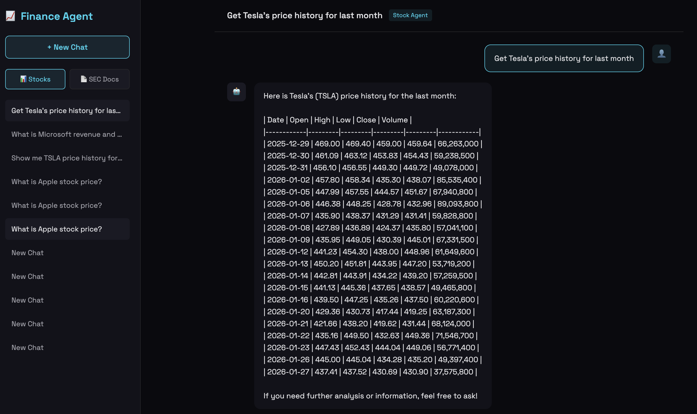
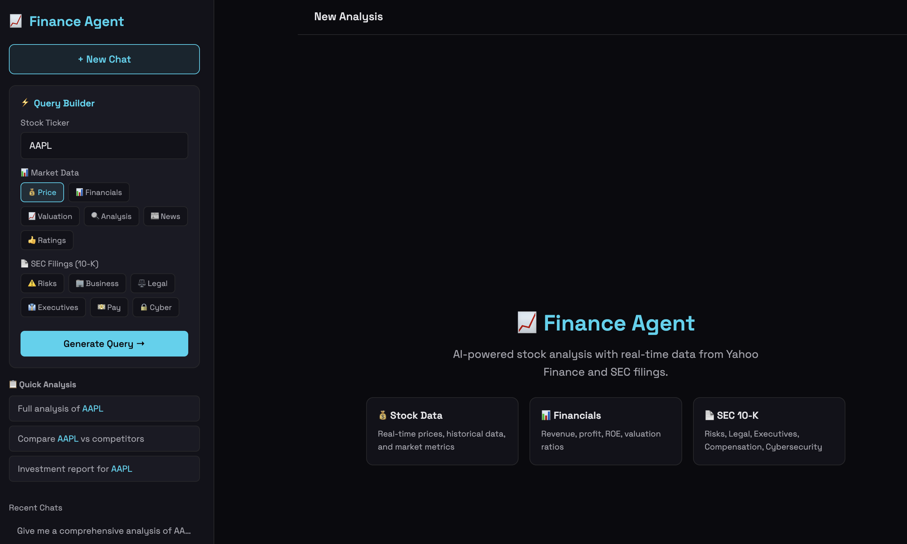

# Yahoo Finance LLM Agent

An AI-powered financial analyst assistant built with FastAPI, LangGraph, and Yahoo Finance. Features natural language queries for real-time stock data, comprehensive financial analysis, and dynamic SEC 10-K document retrieval.

## Demo

### 📊 Stock Analysis


### 📄 SEC Filings Query


### 💬 Chat Interface


---

## Features

### 🤖 Finance Agent (`/api/chat`)
- **Natural Language Queries**: Ask questions like "Analyze Apple's valuation and risks"
- **Real-time Data**: Fetches live data from Yahoo Finance
- **Comprehensive Analysis**: Price, valuation metrics (PE, PB, EV/EBITDA), profitability (ROE, margins), financial health
- **LangSmith Integration**: Full observability and tracing for debugging

### 📄 Dynamic SEC 10-K Retrieval
Fetch any section from SEC 10-K filings for **any US public company** in real-time:

| Section | Description |
|---------|-------------|
| `risk_factors` | Item 1A - Investment risk factors |
| `business` | Item 1 - Business description |
| `mda` | Item 7 - Management Discussion & Analysis |
| `legal` | Item 3 - Legal proceedings & lawsuits |
| `executives` | Item 10 - Directors & executive officers |
| `compensation` | Item 11 - Executive compensation |
| `cybersecurity` | Item 1C - Cybersecurity disclosures (2024 new) |

### 📈 Yahoo Finance Tools
| Tool | Description |
|------|-------------|
| `get_stock_info` | Real-time price, market cap, sector |
| `get_stock_analysis` | Valuation, profitability, financial health metrics |
| `get_historical_data` | Historical price data |
| `get_financials` | Income statement, balance sheet, cash flow |
| `get_stock_news` | Latest news |
| `get_recommendations` | Analyst ratings & price targets |
| `get_holders_info` | Institutional & mutual fund holders |
| `get_stock_actions` | Dividends and splits |
| `get_options_expiration_dates` | Options expiration dates |
| `get_option_chain` | Options chain data |
| `get_sec_filing` | Dynamic SEC 10-K section retrieval |

### 🔍 RAG Document Q&A (`/api/rag`)
- **Vector Search**: FAISS-powered similarity search on local SEC documents
- **Source Citations**: Returns relevant document snippets

---

## Tech Stack

| Component | Technology |
|-----------|------------|
| **Backend** | FastAPI + Uvicorn |
| **LLM** | OpenAI GPT-4o / GPT-4o-mini |
| **Agent Framework** | LangGraph (LangChain 1.x) |
| **Observability** | LangSmith |
| **Vector Store** | FAISS |
| **Database** | SQLite + SQLAlchemy (async) |
| **Data Source** | Yahoo Finance (`yfinance`) |
| **SEC Data** | SEC EDGAR API |

---

## Installation

### 1. Clone & Setup

```bash
git clone <your-repo-url>
cd yahoo-finance-llm-agent

python -m venv venv
source venv/bin/activate  # Windows: venv\Scripts\activate

pip install -r requirements.txt
```

### 2. Configure Environment

Create a `.env` file:

```bash
# Required
OPENAI_API_KEY=your_openai_api_key

# Optional - Model selection
OPENAI_MODEL=gpt-4o-mini

# Optional - LangSmith Tracing (recommended)
LANGSMITH_TRACING=true
LANGSMITH_API_KEY=your_langsmith_api_key
LANGSMITH_PROJECT=finance-agent
```

### 3. Run

```bash
# Development (with auto-reload)
uvicorn main:app --reload --port 8000

# Or use Make
make dev
```

### 4. Access

- **Frontend**: http://localhost:8000
- **API Docs**: http://localhost:8000/docs
- **Health Check**: http://localhost:8000/health

---

## API Usage

### Chat with Finance Agent

```bash
curl -X POST http://localhost:8000/api/chat \
  -H "Content-Type: application/json" \
  -d '{"message": "Analyze AAPL: show me valuation, profitability, and key risks"}'
```

### Get SEC Filing Section

```bash
# Risk factors
curl -X POST http://localhost:8000/api/chat \
  -H "Content-Type: application/json" \
  -d '{"message": "What are Tesla main risk factors from their SEC filing?"}'

# Executive compensation
curl -X POST http://localhost:8000/api/chat \
  -H "Content-Type: application/json" \
  -d '{"message": "Show me Microsoft executive compensation from SEC"}'
```

### Direct Stock API

```bash
curl http://localhost:8000/api/stock/AAPL
curl http://localhost:8000/api/stock/AAPL/chart?period=3mo
curl http://localhost:8000/api/stock/AAPL/news
```

---

## Project Structure

```
yahoo-finance-llm-agent/
├── main.py              # FastAPI entry point
├── agent.py             # LangGraph Finance Agent
├── config.py            # Settings & env management
├── database.py          # SQLAlchemy async setup
├── models.py            # Database models
├── schemas.py           # Pydantic schemas
├── rag.py               # RAG service (FAISS)
├── tools/               # Yahoo Finance & SEC tools
│   ├── get_stock_info.py
│   ├── get_analysis.py
│   ├── get_sec_filing.py   # Dynamic SEC 10-K
│   └── ...
├── routes/              # API routes
│   ├── chat.py
│   ├── rag.py
│   └── stock.py
├── static/              # Frontend
│   └── index.html
├── documents/           # Local SEC docs (optional)
└── requirements.txt
```

---

## License

MIT
