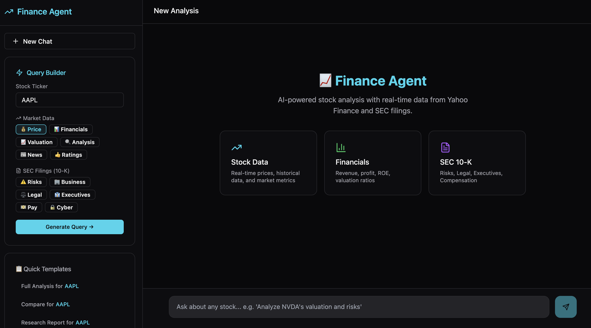

# Yahoo Finance LLM Agent

An AI-powered financial analyst assistant built with FastAPI, LangGraph, and React. Features natural language queries for real-time stock data, comprehensive financial analysis, and dynamic SEC 10-K document retrieval.

## Demo



---

## Features

### 🤖 Finance Agent
- **Natural Language Queries**: Ask questions like "Analyze Apple's valuation and risks"
- **Real-time Data**: Fetches live data from Yahoo Finance
- **Comprehensive Analysis**: Price, valuation metrics (PE, PB, EV/EBITDA), profitability (ROE, margins), financial health
- **LangSmith Integration**: Full observability and tracing

### 📄 Dynamic SEC 10-K Retrieval
Fetch any section from SEC 10-K filings for **any US public company** in real-time:


### 🔍 RAG Pipeline
- **Dynamic Document Ingestion**: Auto-download and cache SEC filings via EDGAR API
- **FAISS Vector Search**: Semantic search with OpenAI embeddings
- **Auto-refresh**: Detects newer filings and updates cache automatically

---

## Tech Stack

| Layer | Technology |
|-------|------------|
| **Frontend** | React + Vite + Tailwind CSS + shadcn/ui |
| **Backend** | FastAPI + Python |
| **Agent** | LangGraph (LangChain 1.x) + OpenAI |
| **Vector Store** | FAISS + OpenAI Embeddings |
| **Data Sources** | Yahoo Finance API, SEC EDGAR API |

---

## Quick Start

### 1. Setup

```bash
git clone <your-repo-url>
cd yahoo-finance-llm-agent

# Backend
python -m venv venv
source venv/bin/activate
pip install -r requirements.txt

# Frontend
cd frontend && npm install
```

### 2. Configure

Create `.env` file:

```bash
OPENAI_API_KEY=your_openai_api_key

# Optional
LANGSMITH_TRACING=true
LANGSMITH_API_KEY=your_langsmith_api_key
```

### 3. Run

```bash
# Backend
uvicorn main:app --reload --port 8000

# Frontend (dev mode)
cd frontend && npm run dev
```

### 4. Access

| URL | Description |
|-----|-------------|
| http://localhost:5173 | Frontend (dev) |
| http://localhost:8000 | Backend API |
| http://localhost:8000/docs | API Documentation |


## License

MIT
